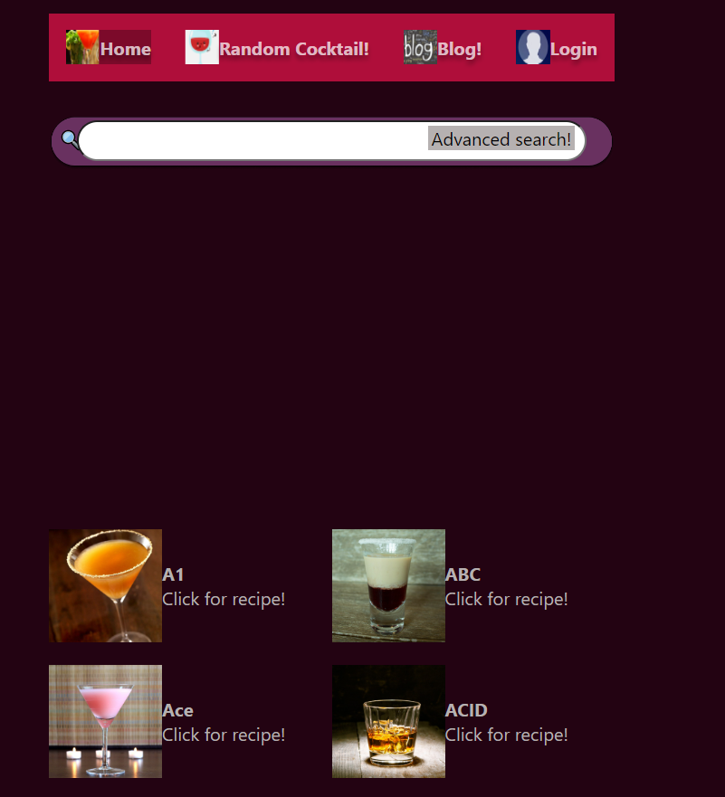

Welcome to my first ever Application! MixB is my pride and enjoy and in this document i will explain how you too can use what i have created and expand upon it.

1. **Functionality**

MixB is here for everyone that wants one convenient simple go to source for cocktail recipes! How to make them for those who know what they want, or even inspiration for those that do not! The home screen is simplicity itself as you can see. The main feature is the search bar where users can enter the name of their desired recipe. On the bottom are some hand picked recipes for those looking to browse.

2. **The essentials for developers**

The API critical for this app is https://www.thecocktaildb.com/api.php. There is no API key, or account only the options offered to free users were used in this application.

You will need an IDE, and install the following NPM modules:
React, React-hook-form, React-router-dom and Axios.

The backend documentation can be found here: https://github.com/hogeschoolnovi/novi-educational-backend-documentation#5-

This backend handles all registration/login/profile picture functionality with axios requests.

3. **Installation steps**

3.1 Start up your IDE of choice

3.2 Clone the repository using HTTPS, SSH or GitHub CLI depending on your preference

3.3 Either run NPM Install in the console or manually run npm install NAME_OF_MODULE all versions used were latest as of 5-11-2022. Issues? See 3.4 else skip ahead to 4.

3.4 If you are running into issues because of feature breaking NPM releases the following versions were used and should be installed: 
   "react": "^18.2.0",

   "react-dom": "^18.2.0",

   "react-hook-form": "^7.38.0",

   "react-router-dom": "^6.4.2",

   "Axios version": "1.1.3",

3.5 Open the console and enter: npm run start and you're set! Typically your IDE will open the app on http://localhost:3000/ for you in your main webbrowser. If not open one and navigate there yourself by pasting the url in by hand. 

4. **Information such as pre made accounts/Api keys**

There are no existing accounts! The app has no use for admin accounts therefore no pre made users were made. As stated earlier there is no API KEY nor account for the API as all that was used were API endpoints of the cocktail API that are freely accessible. 

5.**Additional console commands**

NPM run start is the only command necessary to run this app. No other commands were used. 
   

